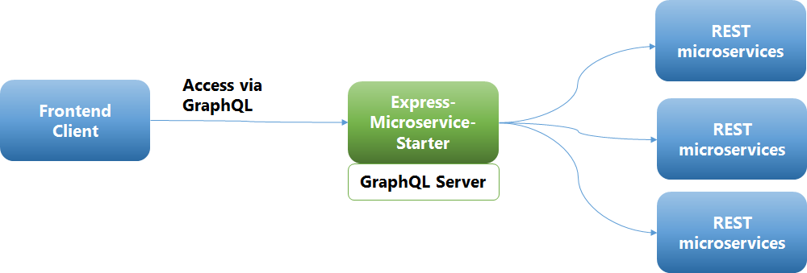
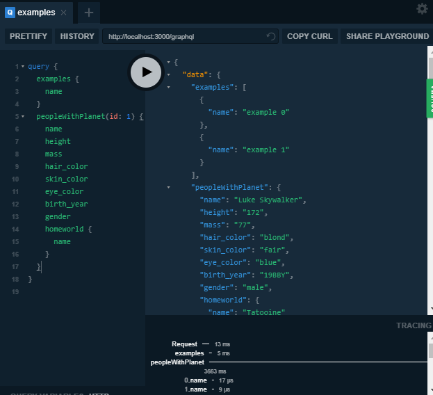
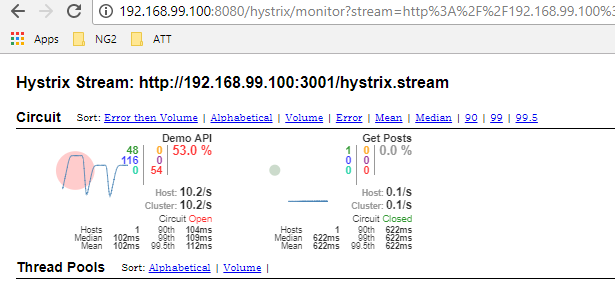

# nxplorerjs-microservice-starter
[](https://travis-ci.org/ERS-HCL/nxplorerjs-microservice-starter) [](https://github.com/facebook/jest) [](https://badge.fury.io/gh/ERS-HCL%2Fnxplorerjs-microservice-starter) [](https://david-dm.org/ERS-HCL/nxplorerjs-microservice-starter)
---


Cloud Native Node JS Express Reactive Microservice Starter Template (REST/GraphQL)
This project provides complete Node JS / Typescript based microservices template with all that will be needed features for production deployment , monitoring , debugging , logging , security. Reactive extensions based samples are added as well to demonstrate how this can be used for building a microservice API edge-service , a backend for frontend or use it as a base for building any kind of microservice.


## Features

* Node JS, Express, Typescript , Dependency Injection base
* Backpack (webpack) based - build , development , packaging
* Swagger Enabled - Express swagger middleware / Swagger UI integration
* Externalized Configuration - DotEnv
* Tests - Jest , SuperTest
* Code Coverage - Istanbul
* Code Quality - tslint
* Container support - Docker , Kubernetes Clusters
* Helm Chart based deployment support
* Prometheus integration
* API Response Logging , Express Server Logging , UUID propogation - Pino
* Reactive Extensions support - RxJS
* CORS, JSONObject Limit , Helmet , CSRF - Express Security
* IOC / Dependency Injection / Express Annotation based APIs - Inversify
* Documentation - TypeDocs
* API Exception Handling Utilities
* Standard HTTP Codes for cleaner code
* Sample APIs, Patterns for reference
* Sonar Qube integration
* Hystrix Circuit Breaker Support (Using Brakes)
* Now using the super fast pino logger for all logging needs
* REST APIs
   - examples - Basic examples with a search by ID example from the jsonplaceholder API (/examples/:id)
   - shop     - Example of how to use Reactive Extensions for API orchestration (FlatMap) (/shop/priceByOptionId/:id)
   - starwars - Example of how to use Reactive Extensions for API orchestration (ForkJoin) (/starwars/people/:id)
   - hystrix  - Example of how to use the circuit break pattern for APIs (/hystrix)
   - Use swagger UI for the complete list of sample APIs
   - metrics  - Prometheus based metrics added for all APIs (/metrics)
   - API Partial JSON response support

```
    curl http://localhost:3000/api/v1/starwars/people/1
```
- Response
```
    {
        name: "Luke Skywalker",
        height: "172",
        mass: "77",
        hair_color: "blond",
        skin_color: "fair",
        eye_color: "blue",
        birth_year: "19BBY",
        gender: "male",
        homeworld: {
        name: "Tatooine",
        rotation_period: "23",
        orbital_period: "304",
        diameter: "10465",
        climate: "arid",
        gravity: "1 standard",
        terrain: "desert",
        surface_water: "1",
        population: "200000",
        residents: [
        "http://swapi.co/api/people/1/",
        "http://swapi.co/api/people/2/",
        "http://swapi.co/api/people/4/",
        "http://swapi.co/api/people/6/",
        "http://swapi.co/api/people/7/",
        "http://swapi.co/api/people/8/",
        "http://swapi.co/api/people/9/",
        "http://swapi.co/api/people/11/",
        "http://swapi.co/api/people/43/",
        "http://swapi.co/api/people/62/"
        ],
        films: [
        "http://swapi.co/api/films/5/",
        "http://swapi.co/api/films/4/",
        "http://swapi.co/api/films/6/",
        "http://swapi.co/api/films/3/",
        "http://swapi.co/api/films/1/"
        ],
        created: "2014-12-09T13:50:49.641000Z",
        edited: "2014-12-21T20:48:04.175778Z",
        url: "http://swapi.co/api/planets/1/"
        },
        films: [
        "http://swapi.co/api/films/2/",
        "http://swapi.co/api/films/6/",
        "http://swapi.co/api/films/3/",
        "http://swapi.co/api/films/1/",
        "http://swapi.co/api/films/7/"
        ],
        species: [
        "http://swapi.co/api/species/1/"
        ],
        vehicles: [
        "http://swapi.co/api/vehicles/14/",
        "http://swapi.co/api/vehicles/30/"
        ],
        starships: [
        "http://swapi.co/api/starships/12/",
        "http://swapi.co/api/starships/22/"
        ],
        created: "2014-12-09T13:50:51.644000Z",
        edited: "2014-12-20T21:17:56.891000Z",
        url: "http://swapi.co/api/people/1/"
        }
```
---
```
    curl http://localhost:3000/api/v1/starwars/people/1?fields=name,gender,homeworld(gravity,population)
```
- Response
```
    {
        name: "Luke Skywalker",
        gender: "male",
        homeworld: {
        gravity: "1 standard",
        population: "200000"
        }
    }
```
* GraphQL
   - GraphQL support has been added based on the [apollo framework](https://github.com/apollographql) and a reference implementation (including the starwars apis from swapi.co)
    
   - Access the graphql playground from http://localhost:3000/playground  
   - Access the graphiql tool from http://localhost:3000/graphiql
   - GraphQL API tracing (configurable)
   - Multiple samples added
      - RxJS API call - peopleWithPlanets(id : <number>)
      - Starwars APIs - people(id: <number>) , planet(id: <number>)
   - List of Queries
      - quoteOfTheDay: String
      - random: Float
      - rollThreeDice: [Int]
      - peopleWithPlanet(id: Int): PeopleWithPlanetType (Uses RxJS to combine results from 2 APIs)
      - people(id: Int): Person
      - planet(id: Int): Planet

    Sample Query Execution
    

    - Mutations
      - addExample(name: String!): ExampleType

    Sample Mutation Execution
    

    - Subscriptions
      - exampleAdded (Will check whenever a new element is added via a mutation)

    Sample Subscription Execution
    
    
    
    

* VSCode Debug Launch Configuration (Preconfigured Debug Launcher added)
* Node Dashboard view added for telemetry during development process
* Added NodeJS cluster mode (load balanced workers)
 - When you start the server it adds workers based on the number of CPUs
```
Master cluster setting up 4 workers...
Worker 2828 is online
Worker 2816 is online
Worker 13956 is online
Worker 3756 is online
up and running in development @: LP-507B9DA1D355 on port: 3000
up and running in development @: LP-507B9DA1D355 on port: 3000
up and running in development @: LP-507B9DA1D355 on port: 3000
up and running in development @: LP-507B9DA1D355 on port: 3000
```
## Pre-requisites

Install npm and nodeJS

npm version >= 3.x
node version >= 6.x

* To use the node dashboard view , install node dashboard at the global level 

```
npm install -g nodejs-dashboard

```
## Install It

```
npm install
```
## Setup *external environment*

* Edit the .env file

| Variable              | Description                           | Default Value |
|-----------------------|---------------------------------------|---------------|
| PORT                  | Server Port                           | 3000          |
| LOG_LEVEL             | Log Level (info,debug,error)          | info          |
| SESSION_SECRET        | String used for signing cookies       |               |
| TIME_OUT              | Default API Timeout (in milli secs)   | 10000         |  
| STREAM_HYSTRIX        | Enable/Disable Hystrix streaming server (true or false)   |   false   |
| CORS                  | Enable/Disable CORS on the server (true or false). Will work only in production build  | false |
| CLUSTER_MODE          | Enable/Disable Node Clustering on the server (true or false) | false |
| SWAGGER_API_DOCS_ROOT | Serves your Swagger API file(s) so they can be used with front-end tools like like Swagger UI, PostMan. | /api/api-docs |
| GRAPHQL_SUBSCRIPTIONS | Enable/Disable GraphQL subscriptions (true or false) | true |
| GRAPHQL_PLAYGROUND | Enable/Disable GraphQL Playground (true or false) | true |
| GRAPHQL_IQL | Enable/Disable GraphQL IQL Explorer (true or false) | true |
| GRAPHQL_TRACING | Enable/Disable GraphQL tracing (true or false) | true |


## Run It
#### Run in *development* mode:

```
npm run dev
```

#### Run in *production* mode:

```
npm run compile
npm start
```

#### Run in *VS Code debug* mode:

```
npm run compile
Press F5
```

#### Runs tests with code coverage:

```
npm run test
```

#### Build Docker image

```
./build-docker.sh
```

#### k8s deployment 
* Helm chart based deployment

```
./deploy-k8s.sh
```

* A sample output

```
release "nxplorerjs-microservice" deleted
NAME:   nxplorerjs-microservice
LAST DEPLOYED: Fri Sep 22 22:10:58 2017
NAMESPACE: default
STATUS: DEPLOYED

RESOURCES:
==> v1/ConfigMap
NAME                          DATA  AGE
nxplorerjs-microservice-starter  5     1s

==> v1/Service
NAME                          CLUSTER-IP  EXTERNAL-IP  PORT(S)       AGE
nxplorerjs-microservice-starter  10.0.0.196  <nodes>      80:30316/TCP  1s

==> v1beta1/Deployment
NAME                          DESIRED  CURRENT  UP-TO-DATE  AVAILABLE  AGE
nxplorerjs-microservice-starter  1        1        1           0          1s


NOTES:
1. Get the application URL by running these commands:
  export NODE_PORT=$(kubectl get --namespace default -o jsonpath="{.spec.ports[0].nodePort}" services nxplorerjs-microservice-nxplorerjs-microservice-starter)
  export NODE_IP=$(kubectl get nodes --namespace default -o jsonpath="{.items[0].status.addresses[0].address}")
  echo http://$NODE_IP:$NODE_PORT

Express Microservice is deployed at  http://192.168.99.100:30316/
```

#### Using node dashboard view (Development Only)
* To use the node dashboard view

```
npm run compile
npm run dash
```
* This will start up the application with the node dashboard attached providing details of the memory , cpu and logs

#### CSRF Security
* CSRF Security has been enabled in the **production** mode
* All POST APIs will require to read the cookie 'XSRF-TOKEN' set in the browser and then pass it in the response head with either of the following keys
   * req.headers['csrf-token'] - the CSRF-Token HTTP request header.
   * req.headers['xsrf-token'] - the XSRF-Token HTTP request header.
   * req.headers['x-csrf-token'] - the X-CSRF-Token HTTP request header.
   * req.headers['x-xsrf-token'] - the X-XSRF-Token HTTP request header.

#### Hystrix Circuit Breaker Support
* Circuit breaker support has been added to the project and uses the hystrix compliant module [brakes](https://github.com/awolden/brakes)
* Streaming support has been disabled by default for Hystrix. 
* Enable it by setting the STREAM_HYSTRIX property to "STREAM_HYSTRIX=true" in the [.env](.env) file
* For convienence a docker version of the Hystrix server has been provided and setup in the [docker-compose.yml](docker-compose.yml) file

##### Steps to execute on Docker

```
npm run compile
docker-compose build
docker-compose up
```
* On Docker set up the port forwarding for 3000 and 8080


* Access the Hystrix dashboard at localhost:8080/hystrix and set the stream location to `localhost:3001/hystrix.stream`
* Execute the samples under /api/v1/hystrix and view the hystrix stream results on the dashboard



### Try It

* Point you're browser to [http://localhost:3000](http://localhost:3000)
* Invoke the example REST endpoints directly or via swagger `http://localhost:3000/swagger`
* Invoke the prometheus metrics using the endpoint `curl http://localhost:3000/metrics`
* Access in-browser IDE for graphQL http://localhost:3000/graphiql
   
### integrate with SonarQube (for continous code quality)
Assuming you have SonarQube 5.5.6 (LTS) installed
* Setup SonarQube with the [Sonar Typescript plugin](https://github.com/Pablissimo/SonarTsPlugin#installation) and the Generic Test Coverage plugin https://docs.sonarqube.org/display/PLUG/Generic+Test+Coverage
* Install sonar-scanner globally (`npm install --global sonar-scanner`)
* Update [`sonar-project.properties`](sonar-project.properties) file for the property `sonar.host.url` to point to your SonarQube server. By default this assumes that the SonarQube server is running locally using the default port
* Run the unit tests
```bash
npm run test
```
* The test results collected in the results folder in the sonar compatible format
* Push results to SonarQube
```bash
npm run sonar-scanner
``` 
* If working with SonarQube 6.x it supports [Generic Test Data](https://docs.sonarqube.org/display/SONAR/Generic+Test+Data)
Modify the [package.json](package.json) to set the appropriate version of the sonarQube
```json
jestSonar": {
    "reportPath": "reports",
    "reportFile": "test-reporter.xml",
    "indent": 4,
    "sonar56x": true
}
```
Note: for Sonar 6.x turn sonar56x to “false” and that will generate the test report that is using the sonar 6 schema.

### Load Testing

* [loadtest](https://www.npmjs.com/package/loadtest) is an excellent tool for loadtesting
* Steps to use it
* Install it as a global npm module
```bash
npm install -g loadtest
``` 
* Start the nxplorerjs-microservice
```bash
npm run start
```
* Run the load test against the production build. Given below is one example
```bash
loadtest http://localhost:3000/api/v1/examples/1 -t 20 -c 20
```

### Future RoadMap
* Authentication using JWT

### FAQ

* tslint error appearing in VSCode IDE for node_modules
```
// Configure glob patterns of file paths to exclude from linting
"tslint.exclude": "**/node_modules/**/*.ts"
```
### Disclaimer

* This is not an official HCL ERS product.

### License

MIT

